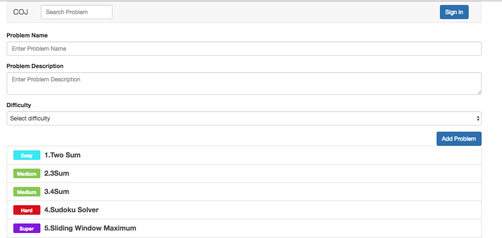
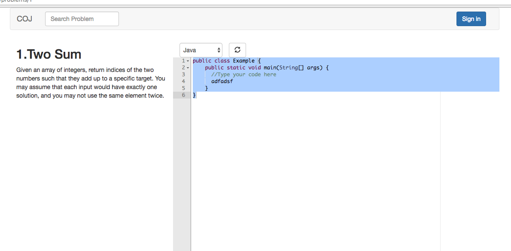
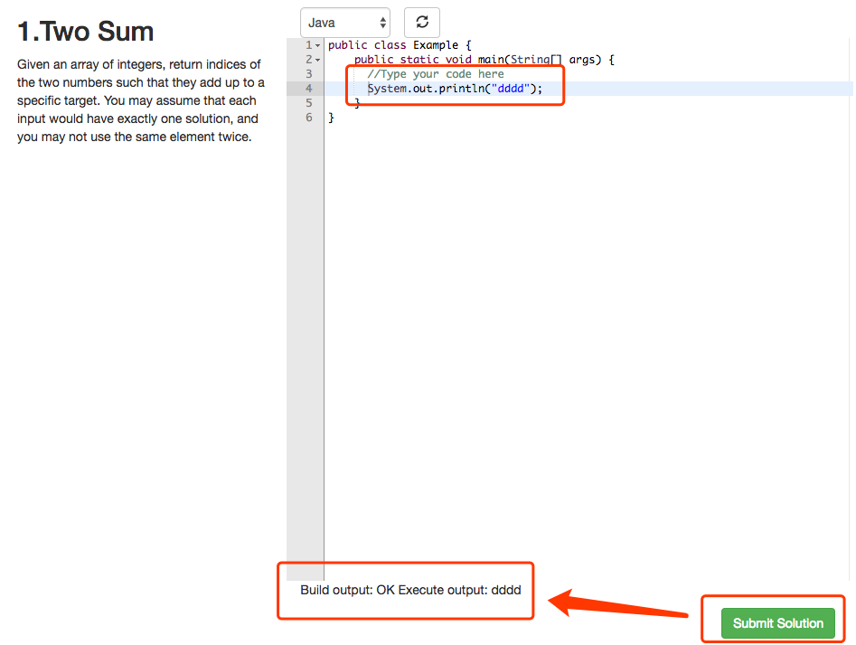

# Collaborate-Online-Judgement-System by Rongjin Qiao

Currently running on http://101.132.43.186:3000/

## Environment settings
Install `npm` and `redis`

Then run `redis` as service

## To start

Inside the project direction

If you are running on linux
```
sh ./launch_linux.sh
```
If you are running on Mac
```
sh ./launch.sh
```

The project will be running on localhost:3000

## To start code analysis service

Install `docker`

Run docker as service

Then
```
cd ./executor
docker build --rm -t rjqiao/coj-demo-1 .
mkdir tmp
python2 executor_utils.py
```

## Tech Details
### Frontend
The client is build on Angular and typescript.


## Previews

### Problem list and new problem


### Problem Details


### Execute Code

